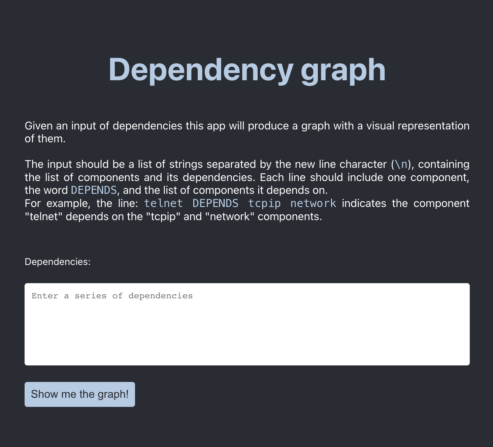
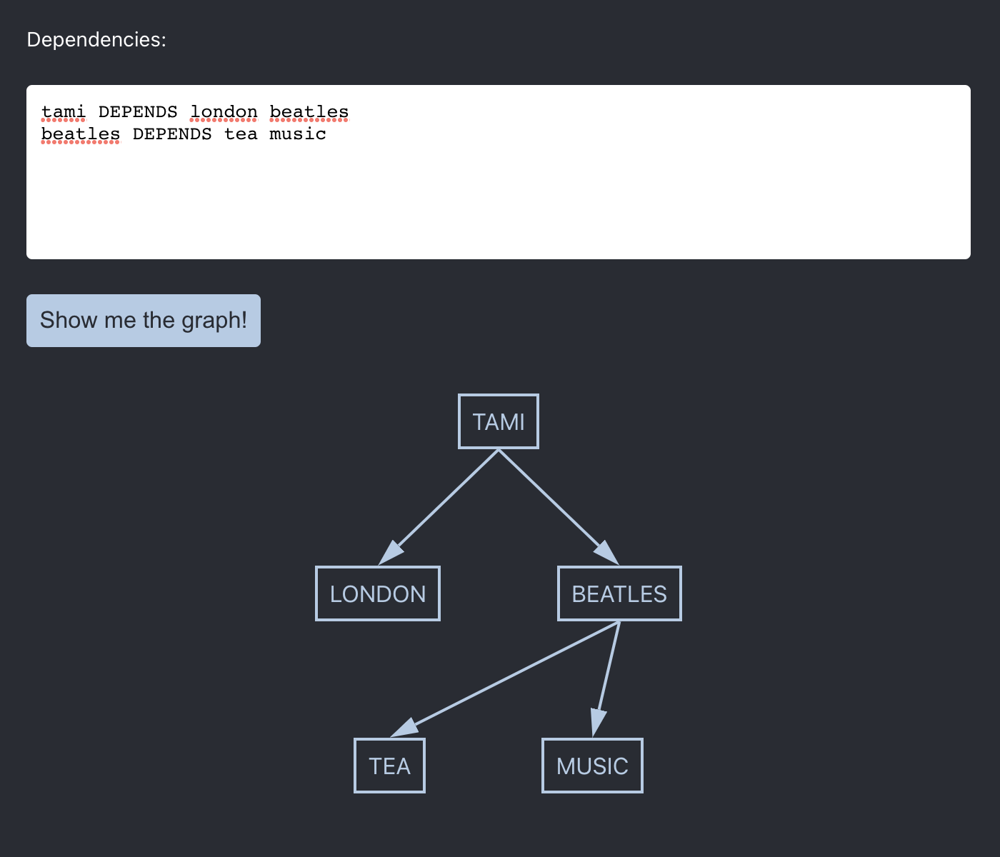

# Dependency graph app

Draw a dependency graph diagram from a string input.

## How to run the app

Clone this repo and go to the project directory. Then run `npm install` (make sure you have Node.js already installed) and `npm start` to start the app in development mode or `npm run start:prod` to start the app in production mode.
Open http://localhost:3000 to view it in the browser.

## How to test the app

Go to the project directory and `npm test`.
